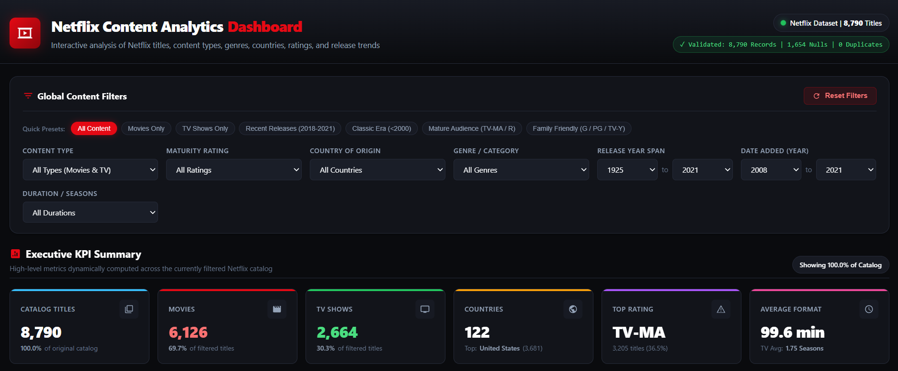

# 📺 Netflix Content Analytics Dashboard

An interactive, production-quality Business Intelligence and Content Analytics Dashboard providing deep exploratory data analysis across Netflix's catalog of 8,790 movies and television series. Built with pure vanilla front-end engineering, high-performance responsive SVG visualizations, and client-side reactive state management.

## 🚀 Live Dashboard

[View Interactive Dashboard](https://agshukla14.github.io/Netflix-Content-Analytics-Dashboard/)
*(Deployable to GitHub Pages instantly with zero dependencies or server configuration)*

### 📸 Dashboard Preview



---

## 📌 Project Overview

The **Netflix Content Analytics Dashboard** delivers an end-to-end analytical view of the streaming platform's catalog evolution, content taxonomy, geographic distribution, audience ratings, and duration patterns. 

Rather than serving as a static chart gallery or generic data grid, this system is architected as an executive Decision Support System (DSS) with synchronized cross-filtering across 10 analytical dimensions, dynamic key performance indicators, reactive natural-language business insights, and an interactive Title Explorer table with fuzzy search and record inspection.

---

## 📊 Dataset

The project is driven by the real-world Netflix catalog dataset (`cleaned_netflix_titles(1).csv`), comprising **8,790 verified title records** spanning productions from **1925 to 2021** across **122 countries**.

### Discovered Dataset Schema

| Column Name | Data Type | Missing / Null Values | Description |
| :--- | :--- | :--- | :--- |
| `show_id` | `String (Identifier)` | 0 (0.0%) | Unique alphanumeric identifier (`s1` through `s8807`) |
| `type` | `Categorical` | 0 (0.0%) | Content category: **Movie** (6,126 titles) or **TV Show** (2,664 titles) |
| `title` | `String` | 0 (0.0%) | Official title of the content entry (8,790 unique titles) |
| `director` | `String` | 2,621 (29.8%) | Director(s) of the film or TV show (`NA` when omitted) |
| `cast` | `String` | 825 (9.4%) | Lead cast and ensemble actors (`NA` when omitted) |
| `country` | `String (Multi-value)`| 829 (9.4%) | Production country or comma-separated list of co-producing countries |
| `date_added` | `Date (String)` | 0 (0.0%) | Catalog upload date (`Month Day, Year`), spanning 2008 to 2021 |
| `release_year` | `Integer` | 0 (0.0%) | Original theatrical or broadcast release year (1925 to 2021) |
| `rating` | `Categorical` | 0 (0.0%) | Maturity classification rating (14 unique tiers: `TV-MA`, `TV-14`, `R`, etc.) |
| `duration` | `String (Formatted)` | 0 (0.0%) | Duration in minutes (`min`) for movies or season counts (`Season`/`Seasons`) |
| `listed_in` | `String (Multi-value)`| 0 (0.0%) | Comma-separated list of catalog genres and categories |
| `description` | `String (Text)` | 0 (0.0%) | Full synopsis and narrative summary of the title |

---

## 📈 Dashboard Features

1. **Executive Dynamic KPIs**: Live calculating metric cards tracking total titles, movies vs. TV shows ratio, country reach, dominant rating tier, average feature runtime, and TV series renewal averages.
2. **Synchronized Global Cross-Filtering**:
   - Quick presets (`All Content`, `Movies Only`, `TV Shows Only`, `Recent 2018-2021`, `Classics <2000`, `Mature Audience`, `Family Safe`)
   - Independent dropdowns for Content Type, Maturity Rating, Country, Genre, Duration Category, Release Year range, and Year Added range.
   - Removable active filter chips with one-click individual dismissal and universal **Reset Filters** button.
3. **10 Specialized Analytical Visualizations**:
   - **Content Type Ratio**: Interactive donut chart with center hole readout, category slice selection, and percentage breakdown.
   - **Catalog Growth Over Time**: Multi-series area chart tracking annual additions (2008–2021) with combined and split views.
   - **Release Era Distribution**: Historical frequency distribution showing content age from archival classics to modern releases.
   - **Top 12 Genres**: Horizontal bar chart parsing and aggregating multi-genre strings.
   - **Geographic Production Hubs**: Top 10 producing nations with co-production split attribution.
   - **Audience Rating Profile**: Classification breakdown across mature, teen, family, and unrated categories.
   - **Movie Runtime Brackets**: Granular histogram (<60 min, 60–89 min, 90–119 min, 120–149 min, 150+ min).
   - **TV Season Renewal Drop-off**: Series renewal trajectory analyzing single-season miniseries vs. long-running franchises.
   - **Genre × Content Type**: Stacked bar comparison isolating Movie vs TV dominance per genre.
   - **Country × Content Type**: Country-level breakdown of domestic feature focus vs. television series production.
4. **Interactive Title Explorer (Data Table)**:
   - Live debounced search across titles, genres, countries, directors, and cast.
   - Multi-column ascending and descending sorting.
   - Configurable page size (10, 25, 50, 100) with responsive pagination bar.
   - Modal Inspector: Click any table row to view the full title synopsis, cast, director, country, and duration.
   - One-click CSV and JSON data export of currently filtered subsets.
5. **Real-Time Automated Insights Engine**: Dynamically written natural-language summaries adapting directly to the active filtered slice.

---

## 🔍 Key Analytical Questions Answered

- **What is the balance between feature films and television series on Netflix?**
  *Movies comprise 69.7% (6,126 titles) of the catalog, outnumbering TV Shows (30.3%, 2,664 titles) by approximately 2.3 to 1.*
- **When was Netflix's peak content acquisition era?**
  *Catalog ingestion surged from 2016 onward, peaking in 2019 with 2,016 title additions (22.9% of the entire library).*
- **What audience maturity ratings dominate the platform?**
  *Mature audiences represent the primary focus: `TV-MA` accounts for 36.5% (3,205 titles) and `TV-14` accounts for 24.5% (2,157 titles), meaning over 60% of titles target viewers 14 and older.*
- **Which countries lead content production on Netflix?**
  *The United States is the primary contributor (3,681 titles), followed by India (1,046 titles) and the United Kingdom (805 titles).*
- **How long are typical Netflix movies and TV shows?**
  *Feature films average 99.6 minutes (ranging from 3-minute shorts to 312-minute epics). In television, 67.2% of shows (1,791 series) run for only a single season.*

---

## 🛠️ Technologies Used

- **HTML5**: Semantic document structuring, ARIA accessibility markup, and responsive layouts.
- **CSS3**: Custom design system, CSS Grid, Flexbox, CSS variables, dark streaming aesthetics, and smooth animations.
- **Vanilla JavaScript (ES6+)**: Custom reactive state store, debounce utilities, SVG math algorithms, and in-memory filtering.
- **SVG (Scalable Vector Graphics)**: Pure vector geometry rendering for charts (arcs, bezier smoothing, histograms) with crisp high-DPI scaling and zero external visualization dependencies.
- **Python 3**: Automated dataset validation (`validate_data.py`), JSON/JS compilation (`export_json.py`), and standalone single-file distribution building (`build_standalone.py`).
- **Node.js**: Automated test suite execution (`test_dashboard.js`).

---

## 📁 Project Structure

```
netflix-dashboard/
├── index.html                   # Main dashboard application entrypoint
├── styles.css                   # Custom responsive dark-theme design system
├── app.js                       # Core dashboard logic, state engine, SVG charts & table
├── data.js                      # Pre-bundled 8,790 records for instant standalone file:// usage
├── data.json                    # Formatted JSON dataset
├── cleaned_netflix_titles(1).csv # Original verified Netflix dataset
├── validate_data.py             # Python dataset integrity and distribution validator
├── export_json.py               # Converter script generating data.json and data.js
├── build_standalone.py          # Single-file HTML bundle compiler (standalone.html)
├── standalone.html              # Fully self-contained single-file dashboard
├── test_dashboard.js            # Automated Node.js / browser test suite (46 assertions)
└── README.md                    # Professional project documentation
```

---

## 📊 Data Validation

Validation executed via `python validate_data.py`:

- **Total Records Validated**: `8,790`
- **Total Columns**: `12`
- **Full Duplicate Rows**: `0`
- **Duplicate Identifiers (`show_id`)**: `0`
- **Total Missing / Null Values**: `4,275`
  - `director`: 2,621 (29.8%)
  - `cast`: 825 (9.4%)
  - `country`: 829 (9.4%)
- **Date Parse Integrity**: `100.0%` (0 invalid dates among 8,790 records)
- **Year Parse Integrity**: `100.0%` (0 invalid years)

---

## 💡 Skills Demonstrated

- **Exploratory Data Analysis (EDA)**: Parsing, type validation, distribution profiling, missing value handling, and categorical aggregation.
- **Business Intelligence (BI) Development**: Designing intuitive KPI hierarchies, comparative category cross-analysis, and actionable executive insight summaries.
- **Front-End Engineering**: Building reactive vanilla JavaScript applications without heavy frameworks, memory-efficient DOM pagination, and sub-millisecond filtering.
- **Data Visualization Design**: Custom mathematical calculation of SVG polar coordinates for donut arcs, cubic bezier smoothing for time series curves, and accessible color ramps.
- **Responsive UI/UX Engineering**: Fluid multi-breakpoint layout systems (mobile, tablet, laptop, ultra-wide) ensuring zero unwanted horizontal page overflow.

---

## 🎯 Project Objective

To demonstrate senior-level data analysis and front-end engineering proficiency by transforming raw streaming platform tabular data into an interactive, portfolio-ready business intelligence platform that provides instantaneous exploratory capabilities, verified statistical rigor, and executive-level clarity.

---

## 🔮 Future Improvements

1. **Natural Language Query Interface**: Integrate client-side semantic querying for prompts such as *"Show comedy movies released in the UK between 2015 and 2020"*.
2. **Actor & Director Network Graph**: Force-directed SVG graph visualizing frequent collaborative partnerships across productions.
3. **Sentiment & Keyword Analysis**: Word cloud and TF-IDF extraction from the title synopsis field (`description`).
4. **Multilingual Localization**: Interface translations into Spanish, French, Hindi, and Japanese.

---

## 👨💻 Author

**Ayush Shukla**  
B.Tech Computer Science & Engineering (AI & ML)  
Adani University  
Graduating 2028  
